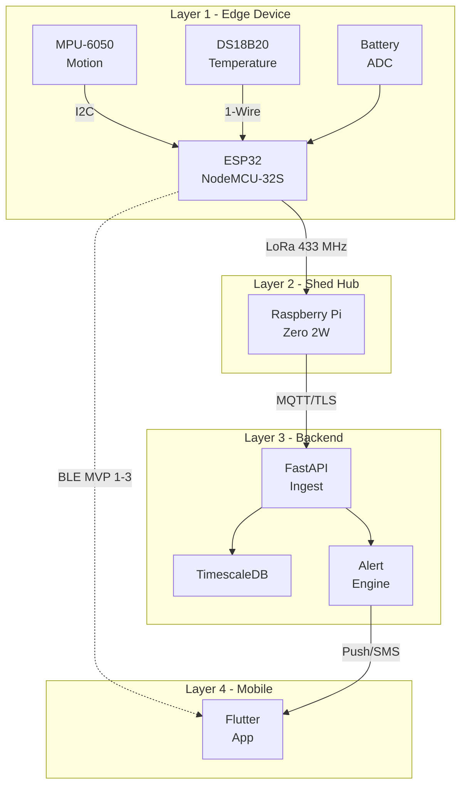

# GoatBand

> Smart neckband for early illness detection in commercial goat farms.

[](#license)
[](#hardware)
[](#firmware)

## Overview

GoatBand is an IoT-based wearable neckband system that continuously monitors goat activity levels and body temperature, detects early signs of illness through behavioral deviation, and alerts farmers via mobile notifications. The system follows a four-layer architecture: edge devices (on-goat neckbands), on-premise gateway (shed hub), cloud backend, and a mobile client application.

### Key Features

- **Real-time motion tracking** — MPU-6050 IMU at 20 Hz with gravity-subtracted activity scoring
- **Skin temperature monitoring** — DS18B20 waterproof probe with 0.0625°C resolution
- **Battery management** — Calibrated ADC monitoring through voltage divider
- **BLE telemetry streaming** — GATT server with JSON notifications every 30 seconds
- **Edge-first compute** — Activity scoring runs on-device, not in the cloud
- **Modular firmware** — Clean driver APIs, each sensor is an independent module
- **Forward-compatible design** — LoRa pins pre-mapped for MVP-4 expansion

## Architecture



## Repository Structure

```
GoatBand_release/
├── README.md                          ← You are here
├── GoatBand_5MVP_Plan.docx            ← Master plan document with embedded diagrams
├── docs/                              ← Technical documentation
│   ├── 01_PROJECT_OVERVIEW.md         ← Goals, scope, BOM, MVP roadmap
│   ├── 02_SYSTEM_ARCHITECTURE.md      ← 4-layer architecture, deployment, security
│   ├── 03_FIRMWARE_DESIGN.md          ← FreeRTOS tasks, boot sequence, concurrency
│   ├── 04_MODULE_REFERENCE.md         ← Per-module API reference with diagrams
│   ├── 05_DATA_FLOW_AND_PROTOCOLS.md  ← Protocol specs, data pipeline, alert logic
│   └── 06_BUILD_AND_DEPLOYMENT.md     ← Build, flash, test, troubleshoot
├── diagrams/                          ← Architecture diagrams (SVG + PNG)
│   ├── 01_component_architecture.*    ← What talks to what
│   ├── 02_system_architecture.*       ← Layered deployment view
│   └── 03_breadboard_tinkercad.*      ← Photorealistic breadboard layout
└── firmware/                          ← ESP-IDF firmware source
    ├── README.md                      ← Firmware-specific build instructions
    ├── platformio.ini                 ← Board, framework, build settings
    ├── partitions.csv                 ← Custom flash layout (24 KB NVS)
    ├── CMakeLists.txt                 ← ESP-IDF project root CMake
    ├── include/
    │   └── pinmap.h                   ← Single source of truth for all pins
    └── src/
        ├── CMakeLists.txt             ← Component registration + dependencies
        ├── main.c                     ← app_main + FreeRTOS task spawning
        ├── mpu6050.c / mpu6050.h      ← I2C motion sensor driver
        ├── ds18b20.c / ds18b20.h      ← 1-Wire temperature driver
        ├── battery.c / battery.h      ← ADC battery voltage monitor
        ├── ble_service.c / ble_service.h  ← Bluedroid GATT server
        └── activity_score.c / activity_score.h ← Activity scoring (MVP-1 placeholder)
```

## Quick Start

### Prerequisites

- [VS Code](https://code.visualstudio.com/) with [PlatformIO IDE](https://platformio.org/install/ide?install=vscode) extension
- ESP32 NodeMCU-32S development board
- MPU-6050 + DS18B20 + supporting components (see [BOM](docs/01_PROJECT_OVERVIEW.md#4-hardware-bill-of-materials-mvp-1))
- USB cable for flashing

### Build and Flash

```bash
# 1. Open firmware/ as PlatformIO project in VS Code
# 2. PlatformIO downloads ESP-IDF v5.x automatically on first build
# 3. Connect ESP32 via USB

# Build
pio run

# Flash
pio run --target upload

# Monitor serial output (115200 baud)
pio device monitor
```

### Verify

1. Open serial monitor — expect JSON output every 30 seconds:
   ```json
   {"t":30,"motion":0.018,"temp":27.43,"batt":3.92,"score":0}
   ```
2. Install **nRF Connect** (Nordic) on your phone
3. Scan for `GoatBand-001` and connect
4. Subscribe to the notification characteristic (UUID ending `...DEF1`)
5. Shake the breadboard — `motion` and `score` should respond
6. Pinch the temperature probe — `temp` should rise

## Hardware Setup

### Pin Map

| ESP32 GPIO | Function | Connected To |
|------------|----------|-------------|
| 21 | I2C SDA | MPU-6050 SDA |
| 22 | I2C SCL | MPU-6050 SCL |
| 4 | 1-Wire | DS18B20 DATA (4.7kΩ pullup to 3V3) |
| 35 | ADC1_CH7 | Battery divider midpoint |
| 23 | SPI MOSI | LoRa SX1276 (MVP-4) |
| 19 | SPI MISO | LoRa SX1276 (MVP-4) |
| 18 | SPI SCK | LoRa SX1276 (MVP-4) |
| 5 | SPI CS | LoRa SX1276 (MVP-4) |
| 14 | Reset | LoRa SX1276 (MVP-4) |
| 26 | DIO0 | LoRa SX1276 (MVP-4) |

### Budget

~₹1,178 per neckband | ~₹15,000 for 5-band deployment with tools and Pi hub.

## Documentation

| Document | Description |
|----------|-------------|
| [Project Overview](docs/01_PROJECT_OVERVIEW.md) | Goals, problem statement, BOM, MVP roadmap, tech stack |
| [System Architecture](docs/02_SYSTEM_ARCHITECTURE.md) | 4-layer architecture, deployment, network topology, security |
| [Firmware Design](docs/03_FIRMWARE_DESIGN.md) | FreeRTOS tasks, boot sequence, concurrency model, memory layout |
| [Module Reference](docs/04_MODULE_REFERENCE.md) | Per-module API docs, data structures, sequence diagrams |
| [Data Flow & Protocols](docs/05_DATA_FLOW_AND_PROTOCOLS.md) | I2C, 1-Wire, BLE, LoRa, MQTT specs, alert classification |
| [Build & Deployment](docs/06_BUILD_AND_DEPLOYMENT.md) | Build steps, testing procedures, wiring guide, troubleshooting |

## MVP Roadmap

| MVP | Focus | Status |
|-----|-------|--------|
| MVP-1 | Bench prototype — sensors + BLE streaming | ✅ Current release |
| MVP-2 | Single goat trial — 72h with deep sleep | 🔜 Next |
| MVP-3 | Per-goat baseline learning + smart alerting | 📋 Planned |
| MVP-4 | LoRa hub — multi-band farm-scale collection | 📋 Planned |
| MVP-5 | Cloud backend + Flutter app + OTA | 📋 Planned |

## Configuration (This Release)

- **Radio**: BLE + LoRa (BLE for phone debug, LoRa for shed hub range)
- **Power**: Battery-only with TP4056 charging (no swap dock for MVP)
- **Sensors**: MPU-6050 motion + DS18B20 temperature
- **Test scale**: 5 bands on real goats
- **Framework**: Pure ESP-IDF, no Arduino
- **Budget**: ~₹15,000 for complete 5-band system

## Contributing

1. Fork the repository
2. Create a feature branch (`git checkout -b feature/my-feature`)
3. Commit your changes (`git commit -m 'Add my feature'`)
4. Push to the branch (`git push origin feature/my-feature`)
5. Open a Pull Request

## License

This project is licensed under the MIT License. See the [LICENSE](LICENSE) file for details.
