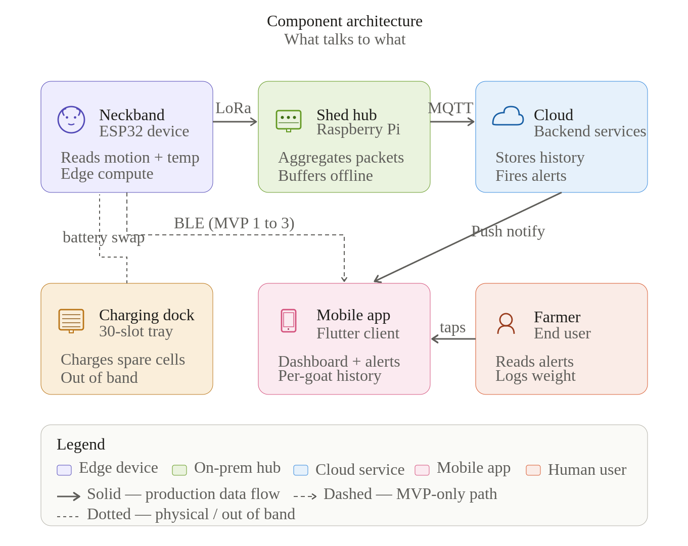
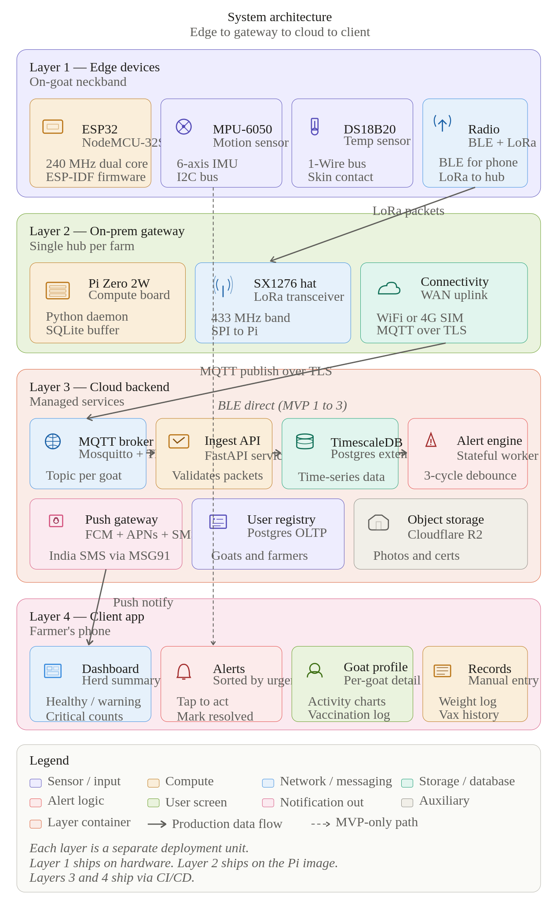
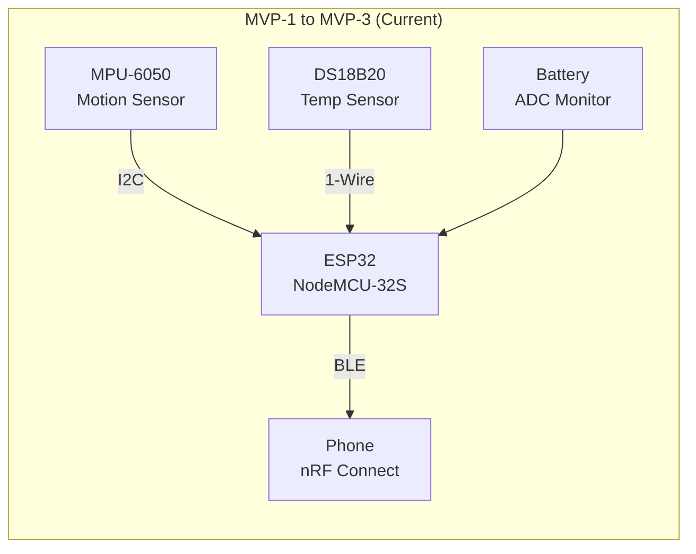
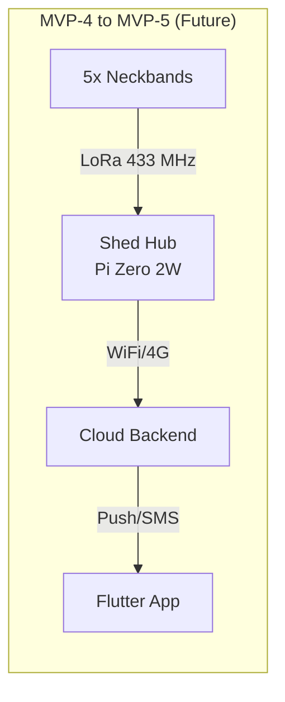
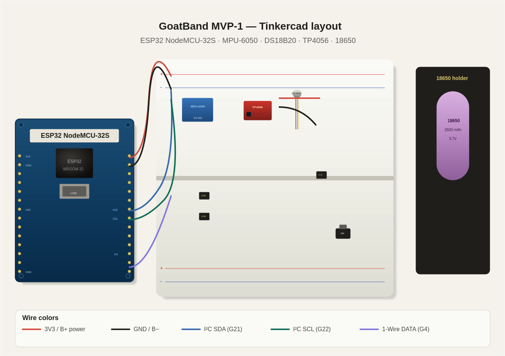
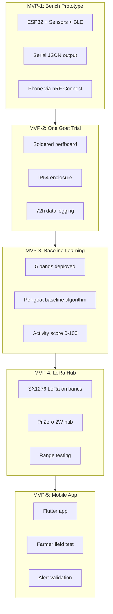

# GoatBand — System Architecture

## 1. Architecture Overview

GoatBand follows a layered IoT architecture. At the current development phase, the focus is on **Layer 1 (edge device)** with BLE connectivity to a phone for testing. Later MVPs progressively add LoRa radio, a gateway hub, and a mobile app.

### Component Architecture

The component architecture diagram shows the six major components — neckband, shed hub, cloud backend, mobile app, charging dock, and farmer — with named protocols on every connector.

- **Solid arrows** = production data paths
- **Dashed arrows** = BLE-only path used during MVP-1 to MVP-3
- **Dotted lines** = physical/out-of-band relationships (battery swap)

### System Architecture (Deployment View)

The system architecture shows four numbered layers stacked from physical edge devices at the top down to the farmer's phone at the bottom. Each layer is a separate deployment unit.

## 2. Current Development Focus

For the initial MVP phase, the active components are:

Starting from MVP-4, LoRa and the shed hub come online:

## 3. Layer Descriptions

### Layer 1 — Edge Devices (On-Goat Neckband)

The wearable neckband is the core of the system. Each band operates independently and performs local edge compute before transmitting summarized telemetry.

| Component | Interface | Function |
|-----------|-----------|----------|
| ESP32 NodeMCU-32S | — | Main MCU, 240 MHz dual-core, FreeRTOS |
| MPU-6050 | I2C (SDA=21, SCL=22, 400 kHz) | 6-axis motion sensor |
| DS18B20 | 1-Wire (GPIO 4, 4.7kΩ pullup) | Skin-contact temperature probe |
| Battery ADC | ADC1_CH7 (GPIO 35, 100k/100k divider) | Battery voltage monitoring |
| BLE (Bluedroid) | On-chip radio | Phone connectivity (MVP-1 to MVP-3) |
| LoRa SX1276 | SPI (MVP-4 onward) | Long-range shed hub connectivity |

**Edge compute responsibilities:**

- 20 Hz motion sampling with gravity subtraction
- 30-second window averaging
- Activity score computation
- JSON telemetry packet assembly
- BLE GATT notification broadcast

### Layer 2 — On-Prem Gateway (MVP-4 Onward)

A single Raspberry Pi Zero 2W per farm receives LoRa packets from all neckbands and relays them onward.

| Component | Function |
|-----------|----------|
| Pi Zero 2W | Gateway compute, Python daemon |
| SX1276 LoRa HAT | LoRa receiver at 433 MHz |
| SQLite | Offline packet buffer |
| WiFi / 4G | Internet connectivity |

### Layer 3 — Cloud Backend (MVP-5)

Cloud services handle long-term storage and notification delivery. Specific technology choices will be evaluated when MVP-4 data collection is proven.

### Layer 4 — Client App (MVP-5)

A Flutter mobile app provides the farmer-facing interface with dashboard, alerts, goat profiles, and manual record entry.

## 4. Breadboard Layout

The Tinkercad-style breadboard layout shows the physical placement of every component for the MVP-1 build:

## 5. Wiring Map

### Power Rail

| From | To | Wire |
|------|----|------|
| 18650 (+) | TP4056 B+ | Red, 22 AWG |
| 18650 (−) | TP4056 B− | Black, 22 AWG |
| TP4056 OUT+ | SPDT switch (common) | Red, 22 AWG |
| SPDT switch (out) | ESP32 VIN | Red, 22 AWG |
| TP4056 OUT− | ESP32 GND | Black, 22 AWG |

### Sensors

| From | To | Notes |
|------|----|-------|
| ESP32 3V3 | MPU-6050 VCC, DS18B20 VCC | Common 3.3V rail |
| ESP32 GND | MPU-6050 GND, DS18B20 GND | Common ground |
| ESP32 GPIO 21 | MPU-6050 SDA | I2C data |
| ESP32 GPIO 22 | MPU-6050 SCL | I2C clock |
| ESP32 GPIO 4 | DS18B20 DATA | 1-Wire — needs 4.7kΩ pullup to 3V3 |

### Battery Monitor

| From | To | Notes |
|------|----|-------|
| Battery + (after switch) | 100kΩ → midpoint → 100kΩ → GND | Half voltage divider |
| Divider midpoint | ESP32 GPIO 35 | ADC1_CH7 — read raw, multiply by 2 |

### LoRa (MVP-4 Onward)

| From | To |
|------|----|
| ESP32 GPIO 5 | RA-02 NSS (CS) |
| ESP32 GPIO 18 | RA-02 SCK |
| ESP32 GPIO 19 | RA-02 MISO |
| ESP32 GPIO 23 | RA-02 MOSI |
| ESP32 GPIO 14 | RA-02 RST |
| ESP32 GPIO 26 | RA-02 DIO0 |
| ESP32 3V3 | RA-02 VCC |
| ESP32 GND | RA-02 GND |

## 6. MVP Progression — What Gets Activated When

