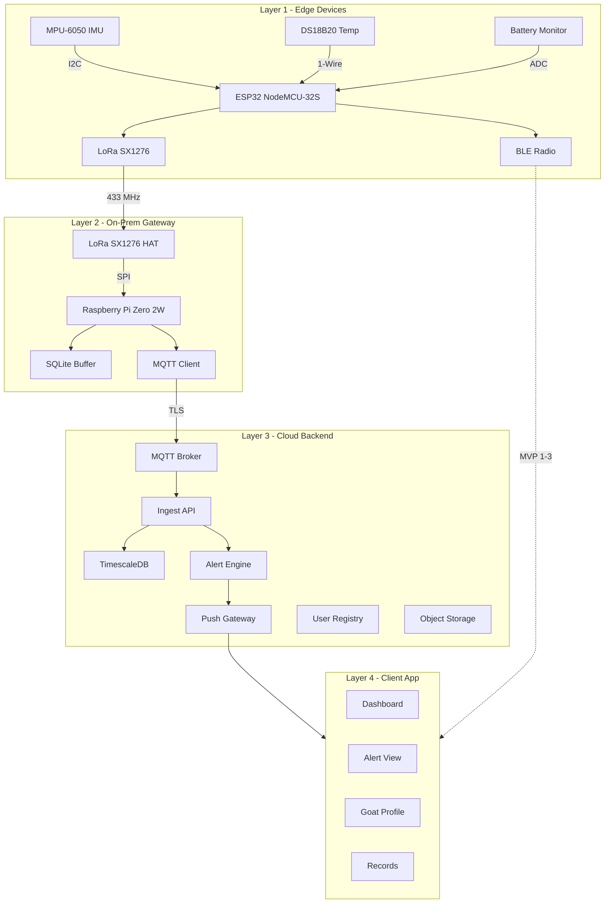
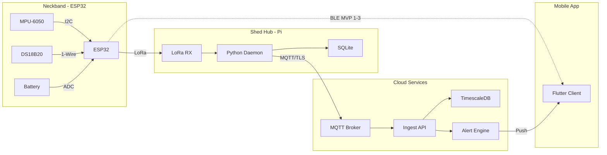
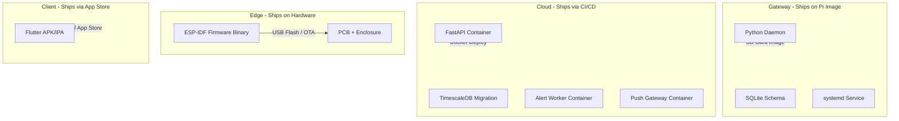
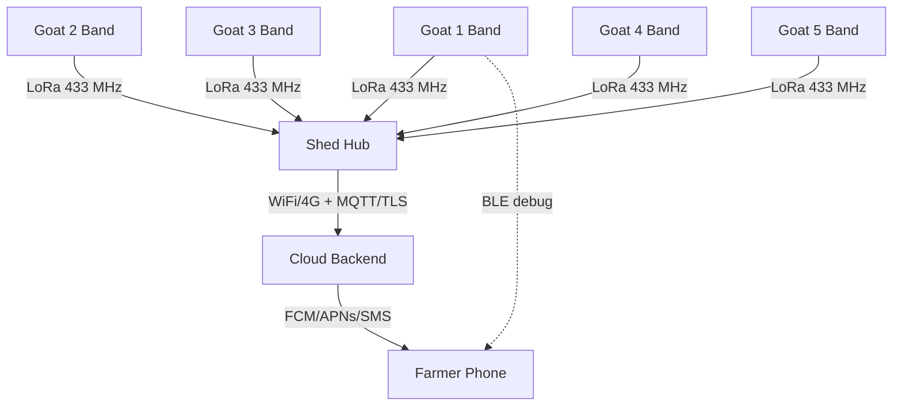

# GoatBand — System Architecture

## 1. Architecture Overview

GoatBand follows a four-layer IoT architecture pattern, with each layer serving as an independent deployment unit. Data flows upward from edge devices through a gateway to cloud services, while alerts and commands flow downward to the farmer's mobile client.

## 2. Layer Descriptions

### 2.1 Layer 1 — Edge Devices (On-Goat Neckband)

The edge layer consists of the wearable neckband device attached to each goat. Each band operates independently and performs local edge compute before transmitting summarized telemetry.

**Components:**

| Component | Interface | Function |
|-----------|-----------|----------|
| ESP32 NodeMCU-32S | — | Main MCU, 240 MHz dual-core, runs FreeRTOS |
| MPU-6050 | I2C (SDA=21, SCL=22, 400 kHz) | 6-axis motion sensor (accelerometer + gyroscope) |
| DS18B20 | 1-Wire (GPIO 4, 4.7kΩ pullup) | Skin-contact temperature probe |
| Battery ADC | ADC1_CH7 (GPIO 35, 100k/100k divider) | Battery voltage monitoring |
| BLE (Bluedroid) | On-chip radio | Short-range phone connectivity |
| LoRa SX1276 | SPI (MOSI=23, MISO=19, SCK=18, CS=5) | Long-range shed hub connectivity |

**Edge compute responsibilities:**
- 20 Hz motion sampling with gravity subtraction
- 30-second window averaging
- Activity score computation (naive in MVP-1, baseline-aware in MVP-3)
- JSON telemetry packet assembly
- BLE GATT notification broadcast

### 2.2 Layer 2 — On-Prem Gateway (Shed Hub)

A single Raspberry Pi Zero 2W per farm acts as the data aggregation point. It receives LoRa packets from all neckbands within range and relays them to the cloud.

**Components:**

| Component | Interface | Function |
|-----------|-----------|----------|
| Pi Zero 2W | — | Gateway compute, runs Python daemon |
| SX1276 HAT | SPI to Pi | LoRa receiver at 433 MHz |
| WiFi / 4G | WAN uplink | Internet connectivity to cloud |
| SQLite | Local file | Offline packet buffer |

**Gateway responsibilities:**
- Receive and decode LoRa packets from multiple bands
- Buffer packets locally in SQLite during connectivity loss
- Publish buffered packets to cloud via MQTT over TLS
- Topic routing: one MQTT topic per goat ID

### 2.3 Layer 3 — Cloud Backend

Managed cloud services handle long-term storage, alert logic, and notification delivery.

**Components:**

| Service | Technology | Function |
|---------|-----------|----------|
| MQTT Broker | Mosquitto + TLS | Receives telemetry from all farm hubs |
| Ingest API | FastAPI (Python) | Validates packets, writes to database |
| TimescaleDB | PostgreSQL extension | Time-series telemetry storage |
| Alert Engine | Stateful Python worker | 3-cycle debounce, WARNING/CRITICAL classification |
| Push Gateway | FCM + APNs + MSG91 | Multi-channel farmer notification |
| User Registry | PostgreSQL (OLTP) | Farmer accounts, goat records, farm mapping |
| Object Storage | Cloudflare R2 | Goat photos, health certificates |

### 2.4 Layer 4 — Client Application

A Flutter-based mobile app provides the farmer-facing interface.

**Screens:**

| Screen | Function |
|--------|----------|
| Dashboard | Herd summary with healthy/warning/critical counts |
| Alerts | Priority-sorted alert list, tap-to-act, mark resolved |
| Goat Profile | Per-goat detail with activity charts, vaccination log |
| Records | Manual entry for weight log, vaccination history |

## 3. Component Architecture Diagram

## 4. Deployment Architecture

Each layer is a separate deployment unit with its own release cycle:

## 5. Network Topology

## 6. Security Considerations

| Layer | Measure |
|-------|---------|
| LoRa link | Encrypted payload (AES-128), frame counter for replay protection |
| MQTT transport | TLS 1.2+ with mutual certificate authentication |
| Cloud API | JWT-based auth, rate limiting, input validation |
| Mobile app | OAuth 2.0 login, certificate pinning |
| Firmware OTA | Signed binary verification before flash |
| NVS storage | Encrypted NVS partition for baseline data |
