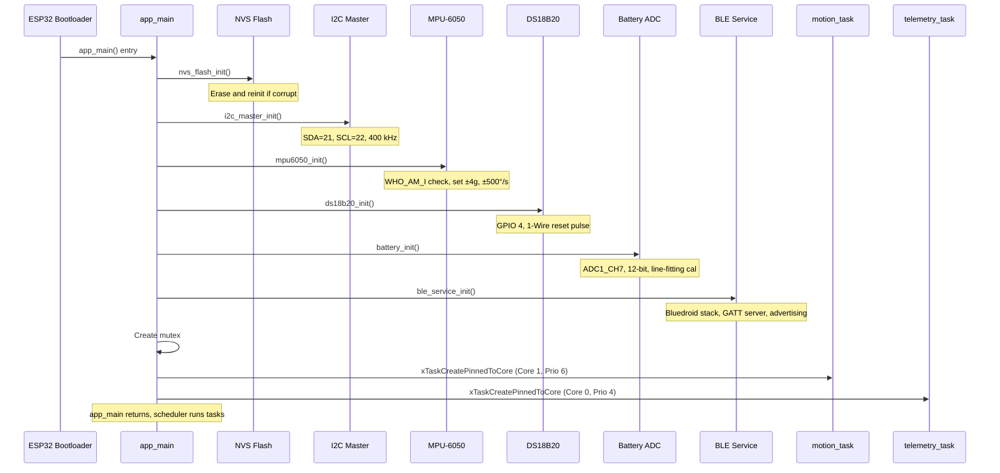
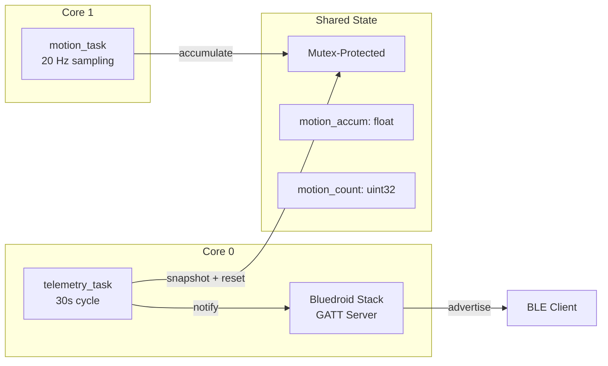
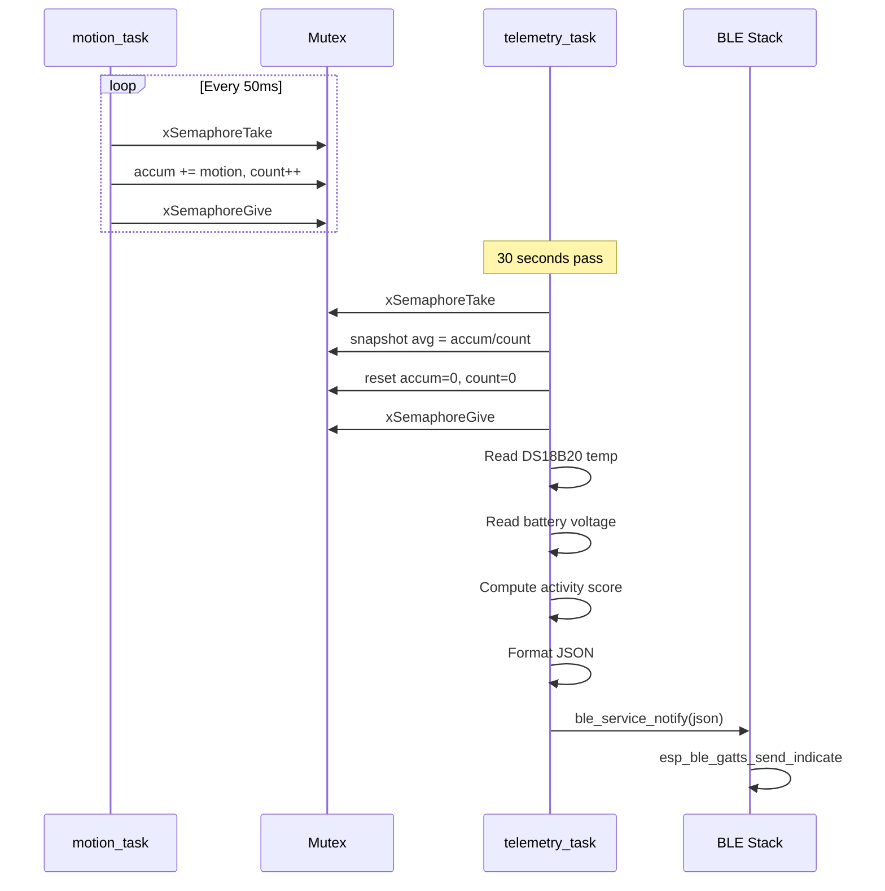
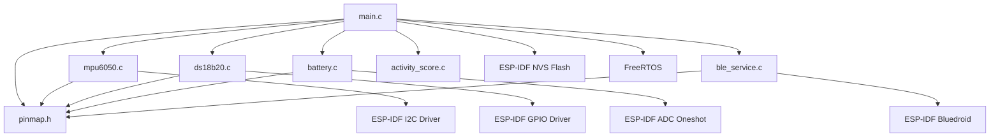

# GoatBand — Firmware Design Document

## 1. Overview

The GoatBand firmware runs on an ESP32 NodeMCU-32S using the ESP-IDF v5.x framework (no Arduino). It is structured as a set of FreeRTOS tasks that cooperatively sample sensors, compute activity scores, and broadcast telemetry over BLE.

**Key design decisions:**
- Pure ESP-IDF for direct FreeRTOS, NVS, ADC v5, and Bluedroid access
- Modular driver architecture — each sensor is an independent compilation unit
- Shared state protected by a FreeRTOS mutex
- Pinned tasks to specific cores for deterministic timing

## 2. Boot Sequence



## 3. FreeRTOS Task Architecture

The firmware runs three concurrent activities:

### 3.1 Task Summary

| Task | Core | Priority | Stack | Period | Function |
|------|------|----------|-------|--------|----------|
| `motion_task` | Core 1 | 6 (high) | 4096 B | 50 ms (20 Hz) | Sample MPU-6050, accumulate motion |
| `telemetry_task` | Core 0 | 4 (medium) | 4096 B | 30,000 ms | Read temp + batt, compute score, BLE notify |
| BLE stack | Core 0 | (internal) | (internal) | Event-driven | Bluedroid GATT server |

### 3.2 Task Interaction Diagram



### 3.3 motion_task Detail

```
LOOP (every 50 ms):
    1. Read MPU-6050 accelerometer (ax, ay, az in m/s²)
    2. Compute magnitude: mag = sqrt(ax² + ay² + az²)
    3. Subtract gravity: motion = |mag - 9.81|
    4. LOCK mutex
    5. motion_accum += motion
    6. motion_count++
    7. UNLOCK mutex
    8. vTaskDelay(50 ms)
```

**Rationale for Core 1 and Priority 6:**
Motion sampling is timing-critical. Running on a dedicated core prevents interference from BLE stack events on Core 0. Higher priority ensures samples are not delayed by telemetry processing.

### 3.4 telemetry_task Detail

```
LOOP (every 30,000 ms):
    1. vTaskDelay(30s)
    2. LOCK mutex
    3. avg_motion = motion_accum / motion_count (or 0 if count=0)
    4. Reset motion_accum = 0, motion_count = 0
    5. UNLOCK mutex
    6. Read DS18B20 temperature (blocks ~800ms for 12-bit conversion)
    7. Read battery voltage via ADC
    8. Compute activity score from avg_motion
    9. Format JSON: {"t":seconds, "motion":0.018, "temp":27.43, "batt":3.92, "score":0}
    10. Log to serial (ESP_LOGI)
    11. Send BLE notification to connected client
```

## 4. Concurrency Model



## 5. Module Dependency Graph



## 6. Memory Layout

### 6.1 Flash Partition Table

| Partition | Type | Offset | Size | Purpose |
|-----------|------|--------|------|---------|
| `nvs` | data/nvs | 0x9000 | 24 KB | Per-goat baselines, BLE bonding |
| `phy_init` | data/phy | 0xF000 | 4 KB | PHY calibration data |
| `factory` | app/factory | 0x10000 | 1536 KB | Firmware binary |
| `storage` | data/spiffs | 0x190000 | 448 KB | SPIFFS for logs/config |

### 6.2 RAM Usage Estimate

| Component | Stack/Heap | Estimate |
|-----------|-----------|----------|
| `motion_task` stack | 4096 B | Fixed |
| `telemetry_task` stack | 4096 B | Fixed |
| Bluedroid stack | ~30 KB | Dynamic (heap) |
| Shared state | ~16 B | Static globals |
| JSON buffer | 256 B | Stack-allocated in telemetry_task |
| **Total estimated** | | **~45 KB** (of 520 KB available) |

## 7. Pin Allocation Map

```
ESP32 NodeMCU-32S Pin Assignment
================================

GPIO 21 ─── I2C SDA ──── MPU-6050 SDA
GPIO 22 ─── I2C SCL ──── MPU-6050 SCL
GPIO 4  ─── 1-Wire ───── DS18B20 DATA (4.7kΩ pullup to 3V3)
GPIO 35 ─── ADC1_CH7 ─── Battery divider midpoint (100k/100k)

--- Reserved for MVP-4 (LoRa SX1276) ---
GPIO 23 ─── SPI MOSI
GPIO 19 ─── SPI MISO
GPIO 18 ─── SPI SCK
GPIO 5  ─── SPI CS
GPIO 14 ─── LoRa RST
GPIO 26 ─── LoRa DIO0
```

## 8. Error Handling Strategy

| Component | Error | Handling |
|-----------|-------|----------|
| MPU-6050 init | WHO_AM_I mismatch | `ESP_FAIL` → logged, boot continues (motion reads will silently fail) |
| DS18B20 init | No presence pulse | `ESP_FAIL` → warning logged, `ds18b20_read_temp()` returns -127.0 |
| Battery ADC | Calibration unavailable | Falls back to raw 12-bit → 3.3V linear conversion |
| BLE init | Any Bluedroid error | `ESP_ERROR_CHECK` → hard fault and reboot |
| I2C read | Timeout | Returns `ESP_ERR_TIMEOUT`, motion sample is skipped |
| NVS init | Corrupt/version mismatch | Erases flash, reinitializes |

## 9. Power Profile (Target)

| State | Current Draw | Duration | Notes |
|-------|-------------|----------|-------|
| Active sampling (20 Hz) | ~80 mA | 30 s | MPU-6050 + ESP32 active |
| Temperature conversion | ~12 mA | 800 ms | DS18B20 12-bit conversion |
| BLE advertising | ~15 mA | Continuous | Interval 20–40 ms |
| Deep sleep (MVP-2+) | ~10 µA | Between windows | RTC wakeup |
| **Target battery life** | | | **50+ days on 2600 mAh cell** |

## 10. Future Firmware Enhancements

| MVP | Enhancement | Impact on Firmware |
|-----|------------|-------------------|
| MVP-2 | Deep sleep between windows | Add `esp_deep_sleep_start()` after telemetry send |
| MVP-3 | Per-goat baseline learning | Replace `activity_score.c` with NVS-backed baseline |
| MVP-4 | LoRa transmission | Enable SPI, add LoRa driver using mapped pins |
| MVP-5 | OTA updates | Add OTA partition, HTTPS pull from cloud |
