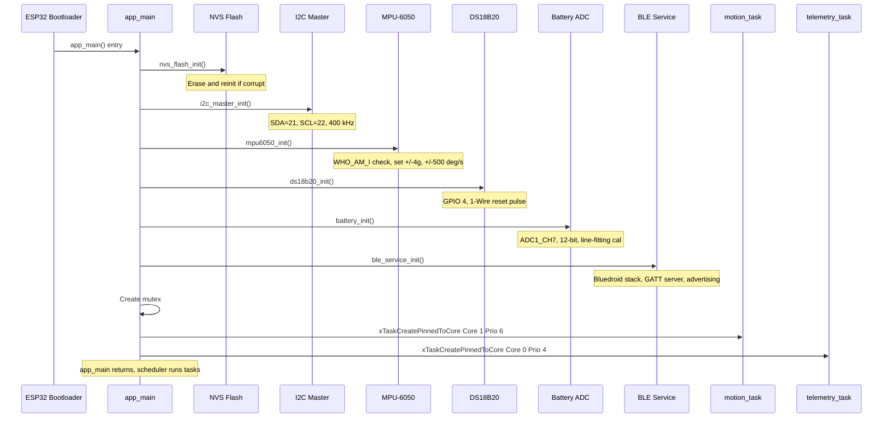
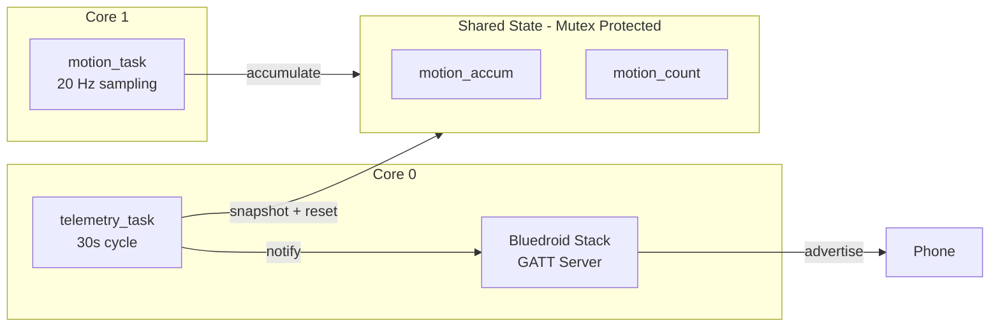
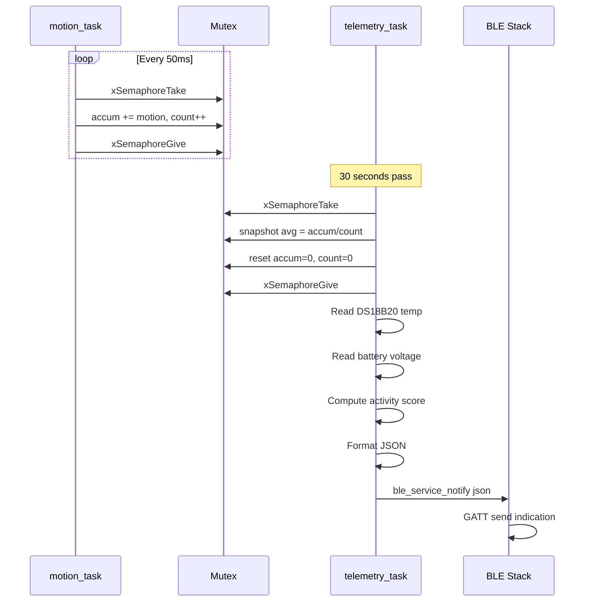
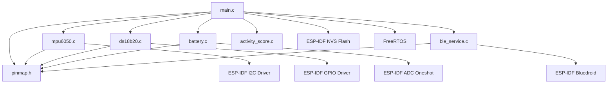
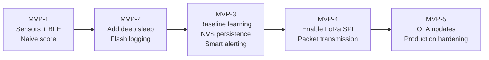

# GoatBand — Firmware Design Document

## 1. Overview

The GoatBand MVP-1 firmware runs on an ESP32 NodeMCU-32S using pure ESP-IDF v5.x (no Arduino). It is built with PlatformIO inside VS Code. The firmware reads motion and temperature sensors, computes an activity score, and streams JSON telemetry over BLE every 30 seconds.

### Why ESP-IDF and Not Arduino

- Direct access to FreeRTOS, NVS, ADC v5 driver, and Bluedroid — the same stack Espressif uses internally
- Finer power control — critical when chasing the 50-day battery target
- Smaller binary and explicit task model — easier to reason about than `setup()`/`loop()`
- Same tooling carries through MVP-5 — no rewrite later for OTA, deep sleep, or custom partitions

## 2. Project Layout

```
firmware/
├── platformio.ini       board: nodemcu-32s, framework: espidf
├── partitions.csv       custom flash layout (larger NVS for baselines)
├── CMakeLists.txt       ESP-IDF requirement
├── include/
│   └── pinmap.h         single source of truth for hardware pins
└── src/
    ├── CMakeLists.txt
    ├── main.c           app_main + 2 FreeRTOS tasks
    ├── mpu6050.c/.h     I2C motion sensor driver
    ├── ds18b20.c/.h     1-Wire temperature driver
    ├── battery.c/.h     ADC v5 oneshot battery monitor
    ├── ble_service.c/.h Bluedroid GATT server
    └── activity_score.c/.h  MVP-1 placeholder, swapped in MVP-3
```

## 3. Boot Sequence



## 4. FreeRTOS Task Architecture

### Task Summary

| Task | Core | Priority | Stack | Period | Function |
|------|------|----------|-------|--------|----------|
| `motion_task` | Core 1 | 6 (high) | 4096 B | 50 ms (20 Hz) | Sample MPU-6050, accumulate motion |
| `telemetry_task` | Core 0 | 4 (normal) | 4096 B | 30,000 ms | Read temp + batt, compute score, BLE notify |
| BLE host stack | Core 0 | (Bluedroid) | (internal) | Event-driven | GAP advertising, GATT connections |

### Task Interaction



### motion_task Detail

Runs at 20 Hz on Core 1. Reads MPU-6050 accelerometer, computes acceleration magnitude, subtracts gravity (9.81 m/s²), and accumulates into shared state.

```
LOOP every 50 ms:
    1. Read MPU-6050 accelerometer (ax, ay, az in m/s2)
    2. Compute magnitude: mag = sqrt(ax^2 + ay^2 + az^2)
    3. Subtract gravity: motion = |mag - 9.81|
    4. LOCK mutex
    5. motion_accum += motion
    6. motion_count++
    7. UNLOCK mutex
    8. vTaskDelay(50 ms)
```

**Why Core 1 and Priority 6**: Motion sampling is timing-critical. A dedicated core prevents interference from BLE stack events on Core 0.

### telemetry_task Detail

Runs every 30 seconds on Core 0. Snapshots the motion accumulator, reads temperature and battery, computes score, formats JSON, and sends BLE notification.

```
LOOP every 30,000 ms:
    1. vTaskDelay(30s)
    2. LOCK mutex
    3. avg_motion = motion_accum / motion_count (or 0)
    4. Reset accum=0, count=0
    5. UNLOCK mutex
    6. Read DS18B20 temperature (blocks ~800ms)
    7. Read battery voltage via ADC
    8. Compute activity score from avg_motion
    9. Format JSON packet
    10. Log to serial
    11. Send BLE notification
```

## 5. Concurrency Model



## 6. Module Dependency Graph



## 7. Memory Layout

### Flash Partition Table

| Partition | Type | Offset | Size | Purpose |
|-----------|------|--------|------|---------|
| `nvs` | data/nvs | 0x9000 | 24 KB | Per-goat baselines (MVP-3), BLE bonding |
| `phy_init` | data/phy | 0xF000 | 4 KB | PHY calibration data |
| `factory` | app/factory | 0x10000 | 1536 KB | Firmware binary |
| `storage` | data/spiffs | 0x190000 | 448 KB | SPIFFS for logs/config |

The NVS partition is deliberately oversized (24 KB vs default 16 KB) to accommodate per-goat baseline storage in MVP-3: 24 hourly profiles × (mean + stdev) × float.

## 8. What MVP-1 Firmware Does NOT Do

These are **intentionally deferred**. Adding them too early creates noise that hides the real bugs:

| Feature | Deferred To | Reason |
|---------|-------------|--------|
| Per-goat baseline learning | MVP-3 | Need real goat data first (from MVP-2) |
| NVS persistence of baselines | MVP-3 | Depends on baseline algorithm |
| LoRa transmission | MVP-4 | Pins already mapped in `pinmap.h` |
| Deep sleep between samples | MVP-2 | Need to measure power profile first |
| OTA firmware updates | MVP-5 | Need cloud infrastructure |

## 9. Firmware Evolution Across MVPs


