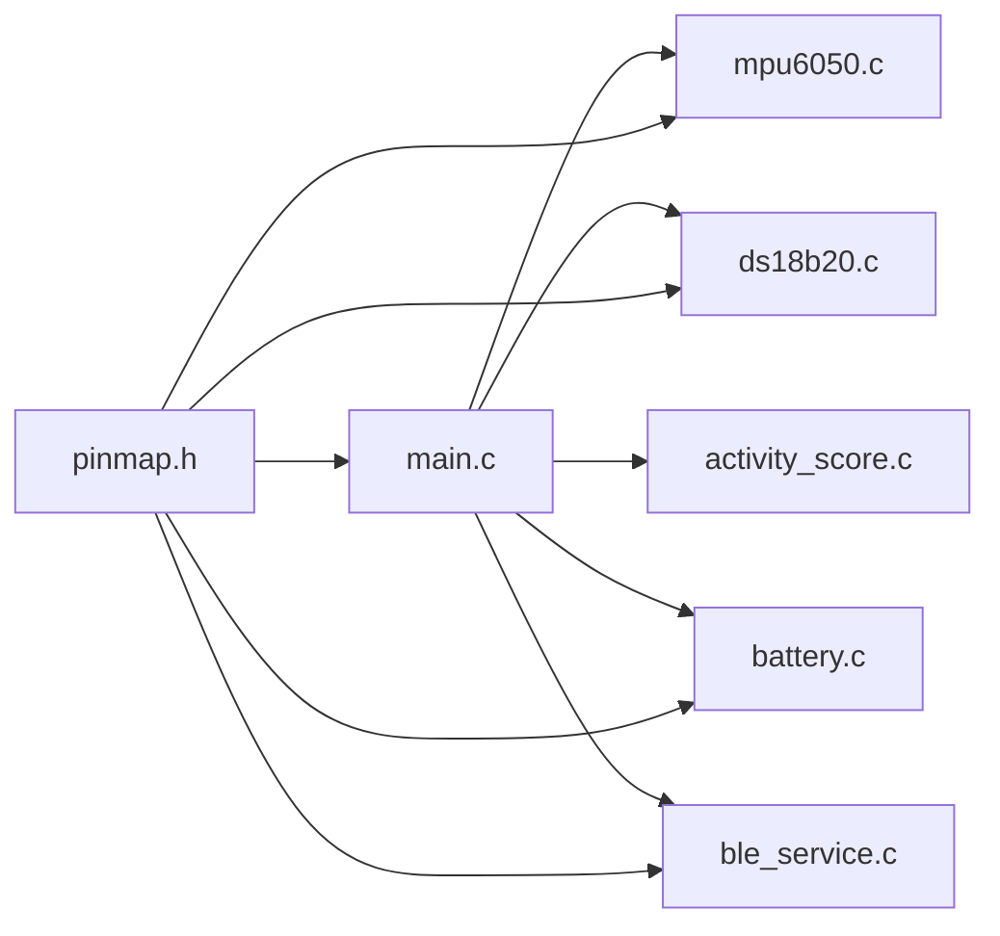
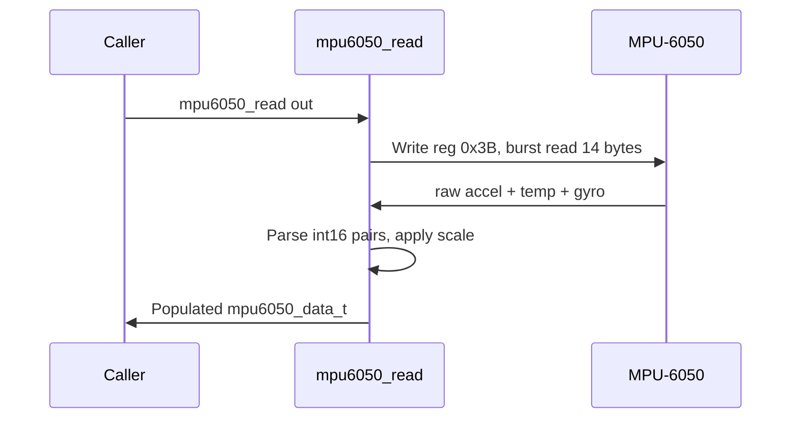
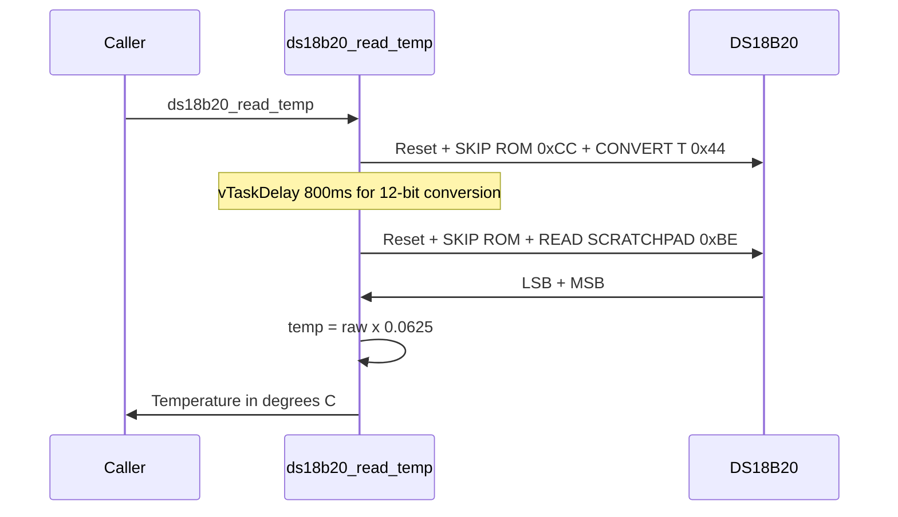
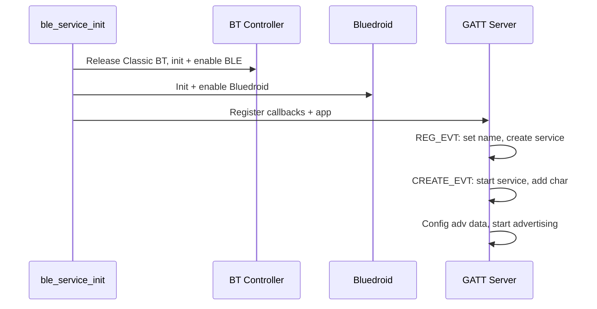

# GoatBand — Module Reference

## 1. Module Map

The firmware has six compilation units, each with a clean header-based API. All hardware configuration is centralized in `pinmap.h`.



---

## 2. pinmap.h — Hardware Pin Map

**Purpose**: Single source of truth for all pin assignments and constants. Change one place, propagates everywhere.

### I2C Bus (MPU-6050)

| Constant | Value | Description |
|----------|-------|-------------|
| `I2C_MASTER_SDA_IO` | 21 | I2C data line |
| `I2C_MASTER_SCL_IO` | 22 | I2C clock line |
| `I2C_MASTER_FREQ_HZ` | 400000 | Fast mode |
| `MPU6050_I2C_ADDR` | 0x68 | Slave address |

### 1-Wire Bus (DS18B20)

| Constant | Value | Description |
|----------|-------|-------------|
| `DS18B20_GPIO` | 4 | Data pin |

### ADC (Battery)

| Constant | Value | Description |
|----------|-------|-------------|
| `BATT_ADC_CHANNEL` | ADC_CHANNEL_7 | GPIO 35 |
| `BATT_DIVIDER_RATIO` | 2.0 | 100k/100k divider |

### LoRa SX1276 (MVP-4 Onward)

| Constant | Value |
|----------|-------|
| `LORA_PIN_MOSI` | 23 |
| `LORA_PIN_MISO` | 19 |
| `LORA_PIN_SCK` | 18 |
| `LORA_PIN_CS` | 5 |
| `LORA_PIN_RST` | 14 |
| `LORA_PIN_DIO0` | 26 |

### Timing

| Constant | Value | Description |
|----------|-------|-------------|
| `MOTION_SAMPLE_HZ` | 20 | Sampling rate |
| `WINDOW_DURATION_MS` | 30000 | 30s telemetry window |
| `BLE_DEVICE_NAME` | "GoatBand-001" | Advertising name |

---

## 3. main.c — Application Entry Point

**Purpose**: Initializes peripherals, creates shared state, spawns FreeRTOS tasks.

### Functions

| Function | Description |
|----------|-------------|
| `app_main()` | Entry point: NVS → I2C → sensors → BLE → spawn tasks |
| `i2c_master_init()` | I2C master on SDA=21, SCL=22, 400 kHz |
| `motion_task()` | 20 Hz MPU-6050 sampling loop (Core 1, Prio 6) |
| `telemetry_task()` | 30s cycle: snapshot motion, read temp+batt, score, BLE notify (Core 0, Prio 4) |

### Shared State

```c
static SemaphoreHandle_t state_mutex;
static float motion_accum  = 0.0f;     // Sum of motion magnitudes
static uint32_t motion_count = 0;       // Number of samples in window
```

### JSON Telemetry Output

```json
{"t":30,"motion":0.018,"temp":27.43,"batt":3.92,"score":0}
```

| Field | Type | Unit | Description |
|-------|------|------|-------------|
| `t` | uint32 | seconds | Uptime since boot |
| `motion` | float | m/s² | Avg gravity-subtracted acceleration |
| `temp` | float | °C | Skin temperature |
| `batt` | float | V | Battery voltage |
| `score` | int | 0–100 | Activity score |

---

## 4. mpu6050.c/.h — Motion Sensor Driver

**Purpose**: Direct register-level I2C driver for MPU-6050 6-axis IMU. No external library.

### API

```c
esp_err_t mpu6050_init(void);                  // WHO_AM_I check, configure
esp_err_t mpu6050_read(mpu6050_data_t *out);   // Burst read 14 bytes
```

### Data Structure

```c
typedef struct {
    float ax, ay, az;   // m/s²
    float gx, gy, gz;   // deg/s
    float temp_c;        // die temperature °C
} mpu6050_data_t;
```

### Configuration

| Register | Value | Effect |
|----------|-------|--------|
| PWR_MGMT_1 (0x6B) | 0x00 | Wake from sleep |
| ACCEL_CONFIG (0x1C) | 0x08 | ±4g range |
| GYRO_CONFIG (0x1B) | 0x08 | ±500°/s range |

### Scale Factors

- Acceleration: `raw * (9.81 / 8192.0)` → m/s²
- Gyroscope: `raw * (1.0 / 65.5)` → °/s
- Temperature: `raw / 340.0 + 36.53` → °C

### Read Sequence



---

## 5. ds18b20.c/.h — Temperature Sensor Driver

**Purpose**: Bit-banged 1-Wire driver for DS18B20. Minimal and self-contained for MVP.

### API

```c
esp_err_t ds18b20_init(void);
float     ds18b20_read_temp(void);   // °C or -127.0 on error
```

### Wiring

- DATA → GPIO 4, VCC → 3V3, GND → GND
- **4.7kΩ pullup from DATA to 3V3 required**

### 1-Wire Protocol

| Function | Timing |
|----------|--------|
| Reset | 480µs low → 70µs wait → sample presence |
| Write '1' | 6µs low → release → 64µs wait |
| Write '0' | 60µs low → release → 10µs wait |
| Read bit | 6µs low → release → 9µs wait → sample |

### Read Sequence



- Resolution: 12-bit (0.0625°C per LSB)
- Conversion: up to 750 ms (800 ms budgeted)
- Uses `vTaskDelay()` to yield CPU during conversion

---

## 6. battery.c/.h — Battery Voltage Monitor

**Purpose**: Reads battery via 100k/100k divider on GPIO 35 using ESP-IDF v5 ADC oneshot with line-fitting calibration.

### API

```c
esp_err_t battery_init(void);
float     battery_read_voltage(void);   // Returns volts
```

### Hardware

```
Battery (3.0-4.2V)
    |
    +-- 100kOhm
    |
    +-- GPIO 35 (ADC1_CH7) -- ESP32
    |
    +-- 100kOhm
    |
    GND
```

### Calculation

- **Calibrated path**: `voltage = (calibrated_mV * 2.0) / 1000.0`
- **Fallback path**: `voltage = (raw / 4095.0) * 3.3 * 2.0`

The legacy `adc1_get_raw()` API is deprecated in IDF v5. This module uses the new oneshot driver.

---

## 7. ble_service.c/.h — BLE GATT Server

**Purpose**: Bluedroid-based GATT server with one NOTIFY+READ characteristic for streaming JSON telemetry.

### API

```c
esp_err_t ble_service_init(void);
void      ble_service_notify(const uint8_t *data, size_t len);
```

### Service Configuration

| Parameter | Value |
|-----------|-------|
| Device name | `GoatBand-001` |
| Service UUID | `12345678-1234-5678-1234-56789ABCDEF0` |
| Char UUID | `12345678-1234-5678-1234-56789ABCDEF1` |
| Properties | READ + NOTIFY |
| Max payload | 240 bytes |
| Adv interval | 20–40 ms |

### Init Sequence



### Connection Lifecycle

| Event | Action |
|-------|--------|
| Client connects | Store `conn_id`, notifications enabled |
| Client disconnects | Reset `conn_id` to 0xFFFF, restart advertising |
| Notify called | Check connection, send via `esp_ble_gatts_send_indicate` |

---

## 8. activity_score.c/.h — Activity Scoring

**Purpose**: Computes activity score (0–100) from average motion. MVP-1 uses naive linear scale. MVP-3 replaces the implementation with per-goat baseline learning.

### API

```c
int activity_score_compute(float avg_motion_ms2);
```

### MVP-1 Algorithm

```
score = clamp(avg_motion * 50, 0, 100)
```

Maps 0–2 m/s² linearly to 0–100.

### MVP-3 Planned Algorithm

The algorithm runs on each band, not in the cloud:

```
Days 1-5 (Learning):
    Record every 30-min activity bucket
    Compute mean and stdev for each hour-of-day (24 profiles)
    Store in NVS flash

Day 6+ (Detection):
    Compare current activity to hourly baseline
    If current < baseline_mean - 1.5 * stdev -> "low" reading
    3 consecutive low readings (~90 min) -> WARNING
    5 consecutive low + temp > 40°C -> CRITICAL
    Reset counter on any normal reading (avoids false alarms from naps)
```

The function signature stays stable — callers in `main.c` do not change when the implementation is upgraded.

---

## 9. Build Configuration

### CMakeLists.txt Dependencies

| ESP-IDF Component | Used By |
|-------------------|---------|
| `driver` | I2C (MPU-6050), GPIO (DS18B20) |
| `nvs_flash` | NVS init, future baselines |
| `esp_adc` | ADC oneshot battery |
| `bt` | Bluedroid BLE |
| `json` | Reserved for future use |

### PlatformIO Build Flags

```ini
build_flags =
    -DCONFIG_BT_ENABLED=1
    -DCONFIG_BT_BLUEDROID_ENABLED=1
    -DCONFIG_BT_BLE_ENABLED=1
```
