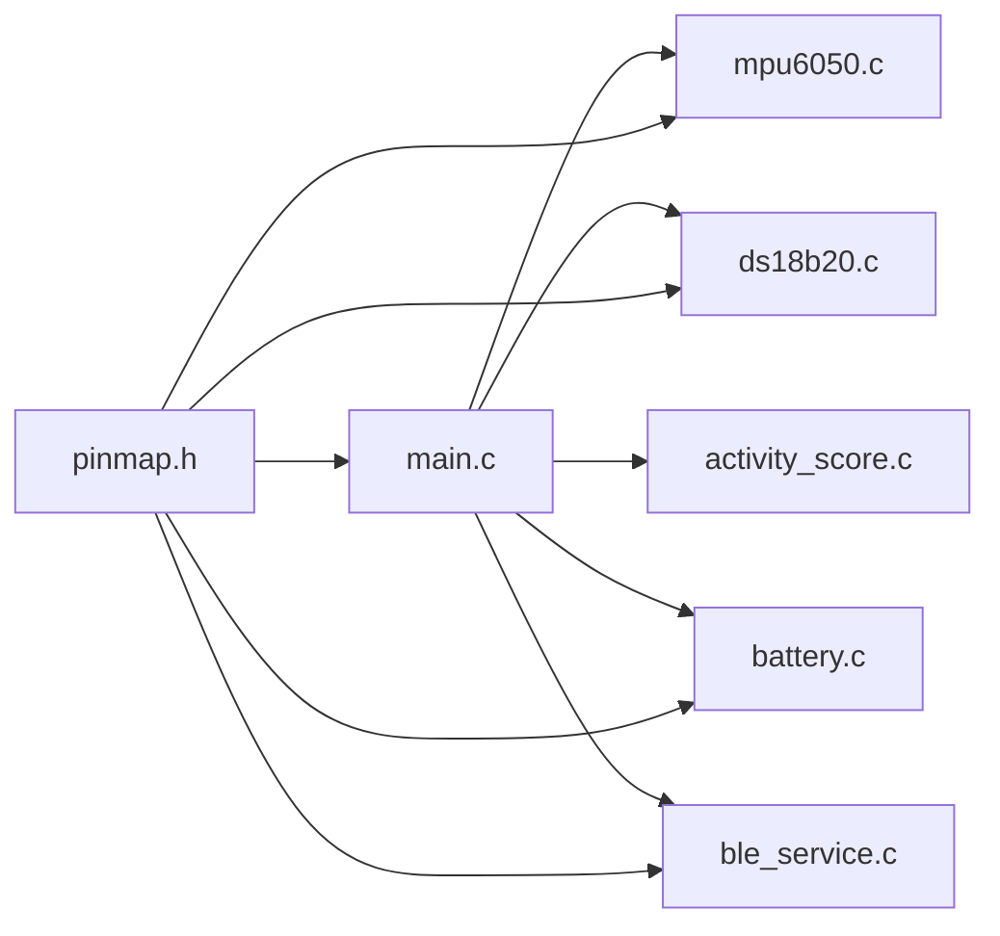
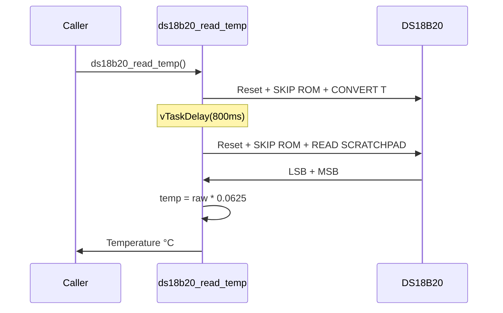
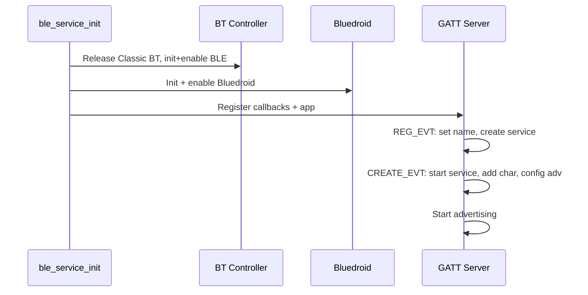

# GoatBand — Module Reference

## 1. Module Overview

The firmware has six compilation units, each with a clean header-based API. All modules depend on `pinmap.h` for hardware configuration.



---

## 2. pinmap.h — Hardware Pin Map

**Purpose**: Single source of truth for all hardware pin assignments and system constants.

### Constants

| Constant | Value | Description |
|----------|-------|-------------|
| `I2C_MASTER_SDA_IO` | 21 | I2C data line |
| `I2C_MASTER_SCL_IO` | 22 | I2C clock line |
| `I2C_MASTER_FREQ_HZ` | 400000 | I2C fast mode |
| `MPU6050_I2C_ADDR` | 0x68 | MPU-6050 slave address |
| `DS18B20_GPIO` | 4 | 1-Wire data pin |
| `BATT_ADC_CHANNEL` | ADC_CHANNEL_7 | GPIO 35 |
| `BATT_DIVIDER_RATIO` | 2.0 | 100k/100k divider |
| `MOTION_SAMPLE_HZ` | 20 | Sampling rate |
| `WINDOW_DURATION_MS` | 30000 | Telemetry window |
| `BLE_DEVICE_NAME` | "GoatBand-001" | Advertising name |
| `NVS_NAMESPACE` | "goatband" | NVS namespace |

LoRa pins (MVP-4): MOSI=23, MISO=19, SCK=18, CS=5, RST=14, DIO0=26.

---

## 3. main.c — Application Entry Point

**Purpose**: Initializes all peripherals, creates shared state, spawns FreeRTOS tasks.

### Functions

| Function | Description |
|----------|-------------|
| `app_main()` | ESP-IDF entry: NVS → I2C → sensors → BLE → tasks |
| `i2c_master_init()` | I2C master on SDA=21, SCL=22, 400 kHz |
| `motion_task()` | 20 Hz MPU-6050 loop, accumulates motion (Core 1, Prio 6) |
| `telemetry_task()` | 30s cycle: snapshot, read temp+batt, score, BLE notify (Core 0, Prio 4) |

### Shared State

```c
static SemaphoreHandle_t state_mutex;
static float motion_accum  = 0.0f;
static uint32_t motion_count = 0;
```

### JSON Output

```json
{"t":30,"motion":0.018,"temp":27.43,"batt":3.92,"score":0}
```

---

## 4. mpu6050.c/.h — Motion Sensor Driver

**Purpose**: Register-level I2C driver for MPU-6050 6-axis IMU.

### API

```c
esp_err_t mpu6050_init(void);           // WHO_AM_I check, set ±4g, ±500°/s
esp_err_t mpu6050_read(mpu6050_data_t *out);  // Burst read 14 bytes
```

### Data Structure

```c
typedef struct {
    float ax, ay, az;   // m/s²
    float gx, gy, gz;   // °/s
    float temp_c;        // °C (die temperature)
} mpu6050_data_t;
```

### Scale Factors

- Acceleration: `raw * (9.81 / 8192.0)` → m/s² (±4g range)
- Gyroscope: `raw * (1.0 / 65.5)` → °/s (±500°/s range)
- Temperature: `raw / 340.0 + 36.53` → °C

### Read Sequence


---

## 5. ds18b20.c/.h — Temperature Sensor Driver

**Purpose**: Bit-banged 1-Wire driver for DS18B20 temperature sensor.

### API

```c
esp_err_t ds18b20_init(void);
float     ds18b20_read_temp(void);   // °C or -127.0 on error
```

### Wiring

- DATA → GPIO 4, VCC → 3V3, GND → GND
- **4.7kΩ pullup from DATA to 3V3 required**

### Read Sequence



---

## 6. battery.c/.h — Battery Voltage Monitor

**Purpose**: Reads battery via 100k/100k divider on GPIO 35 using ESP-IDF v5 ADC oneshot with line-fitting calibration.

### API

```c
esp_err_t battery_init(void);
float     battery_read_voltage(void);   // Returns volts
```

### Voltage Calculation

- Calibrated: `voltage = (calibrated_mV * 2.0) / 1000.0`
- Fallback: `voltage = (raw / 4095.0) * 3.3 * 2.0`

---

## 7. ble_service.c/.h — BLE GATT Server

**Purpose**: Bluedroid-based GATT server with one NOTIFY+READ characteristic.

### API

```c
esp_err_t ble_service_init(void);
void      ble_service_notify(const uint8_t *data, size_t len);
```

### Service Config

| Parameter | Value |
|-----------|-------|
| Service UUID | `12345678-1234-5678-1234-56789ABCDEF0` |
| Char UUID | `12345678-1234-5678-1234-56789ABCDEF1` |
| Properties | READ + NOTIFY |
| Max value length | 240 bytes |
| Adv interval | 20–40 ms |

### Init Sequence



---

## 8. activity_score.c/.h — Activity Scoring

**Purpose**: Computes integer activity score (0–100) from average motion.

### API

```c
int activity_score_compute(float avg_motion_ms2);
```

### MVP-1 Algorithm

`score = clamp(avg_motion * 50, 0, 100)` — linear scale, 0–2 m/s² → 0–100.

### MVP-3 Upgrade Plan

- Days 1–5: Learn hourly mean/stdev per goat (NVS storage)
- Day 6+: Compare current to `baseline_mean - 1.5 * stdev`
- 3 low windows → WARNING; 5 low + temp>40°C → CRITICAL

The function signature stays stable so callers do not change.

---

## 9. Build Configuration (CMakeLists.txt)

### ESP-IDF Dependencies

| Component | Used By |
|-----------|---------|
| `driver` | I2C (MPU-6050), GPIO (DS18B20) |
| `nvs_flash` | NVS init, baselines |
| `esp_adc` | ADC oneshot battery |
| `bt` | Bluedroid BLE |
| `json` | Reserved for future |
