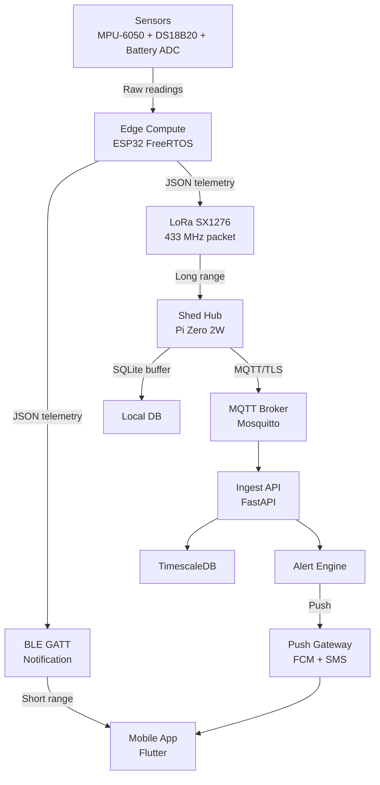
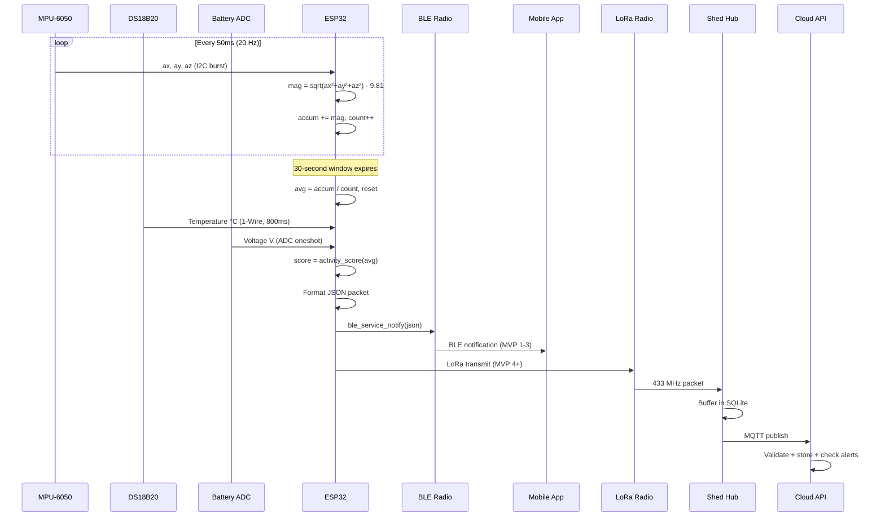
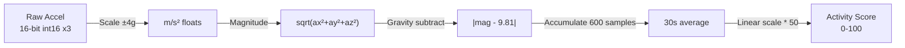
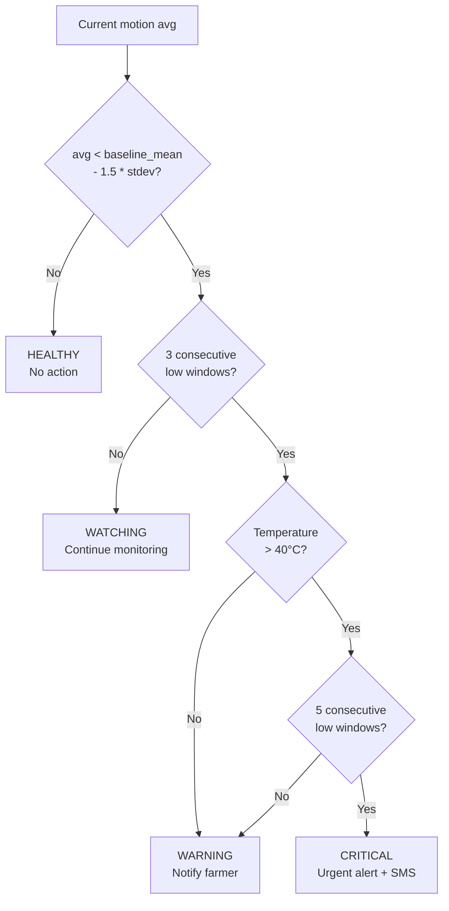

# GoatBand — Data Flow and Protocols

## 1. End-to-End Data Flow



## 2. Telemetry Packet Lifecycle



## 3. Protocol Specifications

### 3.1 BLE GATT

| Parameter | Value |
|-----------|-------|
| Transport | Bluetooth Low Energy 4.2 |
| Stack | ESP-IDF Bluedroid |
| Service UUID | `12345678-1234-5678-1234-56789ABCDEF0` |
| Characteristic UUID | `12345678-1234-5678-1234-56789ABCDEF1` |
| Operation | NOTIFY (server-initiated, no ACK) |
| Payload | UTF-8 JSON string, max 240 bytes |
| Interval | Every 30 seconds |

### 3.2 JSON Telemetry Schema

```json
{
  "t": 30,
  "motion": 0.018,
  "temp": 27.43,
  "batt": 3.92,
  "score": 0
}
```

| Field | Type | Unit | Range | Description |
|-------|------|------|-------|-------------|
| `t` | uint32 | seconds | 0–∞ | Uptime since boot |
| `motion` | float32 | m/s² | 0.0–20.0 | Avg gravity-subtracted acceleration |
| `temp` | float32 | °C | -55.0–125.0 | Skin temperature |
| `batt` | float32 | V | 0.0–4.2 | Battery voltage |
| `score` | int | — | 0–100 | Activity score |

### 3.3 I2C (MPU-6050)

| Parameter | Value |
|-----------|-------|
| Mode | Master |
| Speed | 400 kHz (fast mode) |
| SDA | GPIO 21 |
| SCL | GPIO 22 |
| Address | 0x68 (7-bit) |
| Read length | 14 bytes burst (ACCEL_XOUT_H through GYRO_ZOUT_L) |

### 3.4 1-Wire (DS18B20)

| Parameter | Value |
|-----------|-------|
| GPIO | 4 |
| Pullup | 4.7kΩ external to 3V3 |
| Reset pulse | 480µs low + 70µs sample |
| Commands used | SKIP ROM (0xCC), CONVERT T (0x44), READ SCRATCHPAD (0xBE) |
| Resolution | 12-bit (0.0625°C/LSB) |
| Conversion time | 750 ms (800 ms budgeted) |

### 3.5 ADC (Battery)

| Parameter | Value |
|-----------|-------|
| Channel | ADC1_CH7 (GPIO 35) |
| Attenuation | 12 dB |
| Resolution | 12-bit |
| Calibration | Line-fitting (if eFuse data available) |
| Divider | 100kΩ / 100kΩ (ratio 2.0) |

### 3.6 LoRa (MVP-4)

| Parameter | Value |
|-----------|-------|
| Module | SX1276 |
| Frequency | 433 MHz ISM band |
| SPI bus | SPI2_HOST |
| Encryption | AES-128 payload |
| Topology | Star (bands → hub) |

### 3.7 MQTT (MVP-4)

| Parameter | Value |
|-----------|-------|
| Broker | Mosquitto |
| Transport | TLS 1.2+ |
| Topic format | `farm/{farm_id}/goat/{goat_id}/telemetry` |
| QoS | 1 (at-least-once) |
| Payload | JSON telemetry packet |

## 4. Data Processing Pipeline



## 5. Alert Classification (MVP-3+)



## 6. Timing Diagram

```
Time (seconds): 0         30        60        90        120
                |---------|---------|---------|---------|
motion_task:    ████████████████████████████████████████████
                ^20Hz     ^20Hz     ^20Hz     ^20Hz
                600 samples per window

telemetry_task: |----W1----|----W2----|----W3----|----W4----|
                      ↑          ↑          ↑          ↑
                   snapshot   snapshot   snapshot   snapshot
                   + temp     + temp     + temp     + temp
                   + batt     + batt     + batt     + batt
                   + BLE      + BLE      + BLE      + BLE
```

Each 30-second window produces one JSON telemetry packet with averaged motion, point-in-time temperature, battery voltage, and computed activity score.
