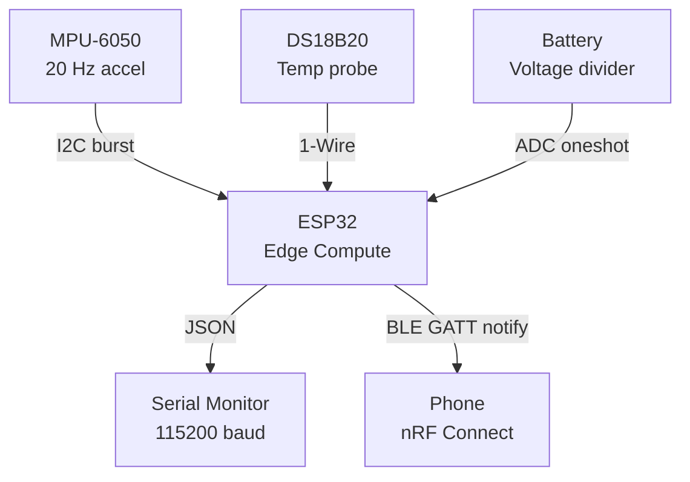
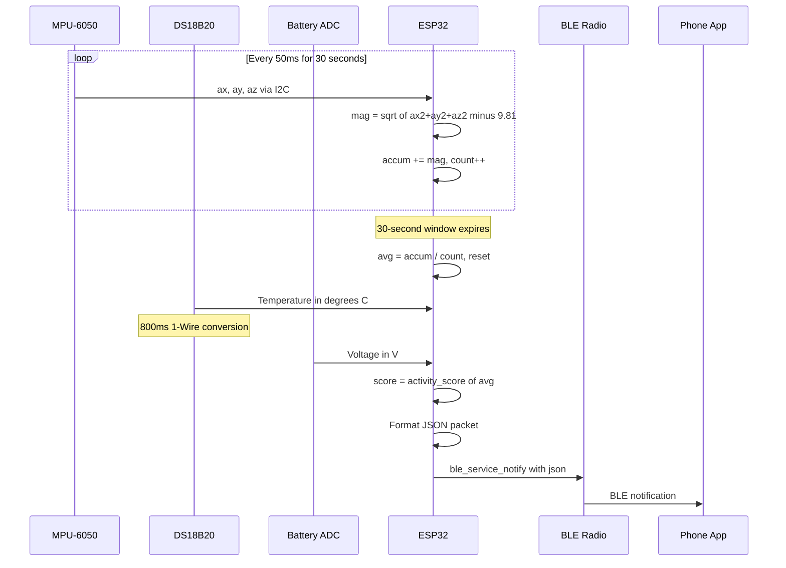
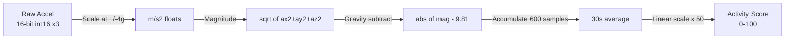
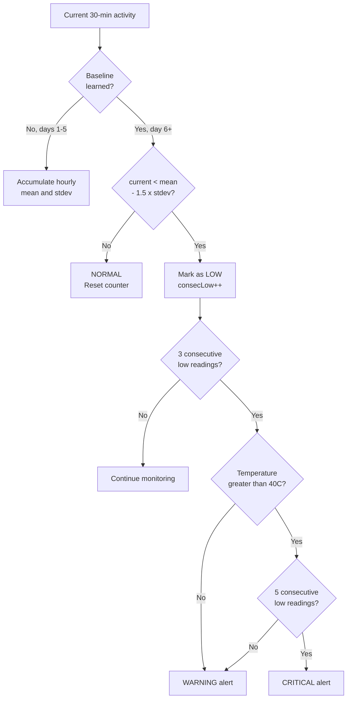
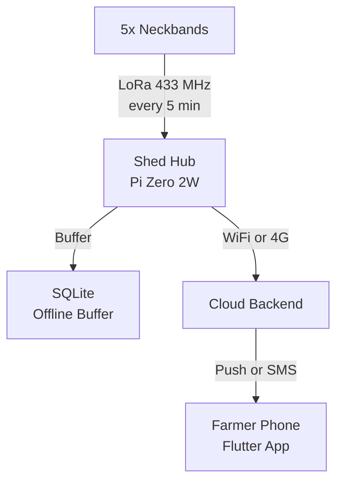

# GoatBand — Data Flow and Protocols

## 1. Current Data Flow (MVP-1 to MVP-3)

In the initial development phase, data flows from sensors through the ESP32 to a phone via BLE:



## 2. Telemetry Packet Lifecycle



## 3. JSON Telemetry Schema

Each 30-second window produces one JSON packet:

```json
{"t":30,"motion":0.018,"temp":27.43,"batt":3.92,"score":0}
```

| Field | Type | Unit | Range | Description |
|-------|------|------|-------|-------------|
| `t` | uint32 | seconds | 0+ | Uptime since boot |
| `motion` | float | m/s² | 0.0–20.0 | Avg gravity-subtracted acceleration |
| `temp` | float | °C | -55.0–125.0 | Skin temperature |
| `batt` | float | V | 0.0–4.2 | Battery voltage |
| `score` | int | — | 0–100 | Activity score |

## 4. Protocol Specifications

### 4.1 I2C — MPU-6050

| Parameter | Value |
|-----------|-------|
| Mode | Master |
| Speed | 400 kHz (fast mode) |
| SDA | GPIO 21 |
| SCL | GPIO 22 |
| Address | 0x68 (7-bit) |
| Read | 14-byte burst from register 0x3B |

### 4.2 1-Wire — DS18B20

| Parameter | Value |
|-----------|-------|
| GPIO | 4 |
| Pullup | 4.7kΩ external to 3V3 |
| Reset pulse | 480µs low + 70µs sample |
| Commands | SKIP ROM (0xCC), CONVERT T (0x44), READ SCRATCHPAD (0xBE) |
| Resolution | 12-bit (0.0625°C per LSB) |
| Conversion time | 750 ms (800 ms budgeted) |

### 4.3 ADC — Battery

| Parameter | Value |
|-----------|-------|
| Channel | ADC1_CH7 (GPIO 35) |
| Attenuation | 12 dB |
| Resolution | 12-bit (4096 levels) |
| Calibration | Line-fitting (if eFuse data available) |
| Divider | 100kΩ / 100kΩ (ratio 2.0) |

### 4.4 BLE GATT

| Parameter | Value |
|-----------|-------|
| Transport | Bluetooth Low Energy 4.2 |
| Stack | ESP-IDF Bluedroid |
| Service UUID | 12345678-1234-5678-1234-56789ABCDEF0 |
| Char UUID | 12345678-1234-5678-1234-56789ABCDEF1 |
| Operation | NOTIFY (server-initiated, no ACK) |
| Payload | UTF-8 JSON, max 240 bytes |
| Interval | Every 30 seconds |

### 4.5 LoRa — SX1276 (MVP-4 Onward)

| Parameter | Value |
|-----------|-------|
| Module | SX1276 RA-02 |
| Frequency | 433 MHz ISM band |
| SPI bus | SPI2_HOST |
| Topology | Star (bands to hub) |
| Pins | MOSI=23, MISO=19, SCK=18, CS=5, RST=14, DIO0=26 |

## 5. Data Processing Pipeline



**600 samples**: 20 Hz × 30 seconds = 600 motion samples per telemetry window.

## 6. MVP-3 Alert Classification (Planned)

The baseline learning algorithm is the core of the product. It runs **on-device**, not in the cloud.



**Key design decisions:**
- 3 consecutive low readings (~90 min) triggers WARNING
- 5 consecutive low + fever triggers CRITICAL
- Counter resets on any normal reading — avoids false alarms from afternoon naps
- Baselines stored in NVS flash on the ESP32 itself

## 7. Timing Diagram

```
Time (seconds): 0         30        60        90        120
                |---------|---------|---------|---------|
motion_task:    ████████████████████████████████████████████
                20Hz      20Hz      20Hz      20Hz
                600 samples per window

telemetry_task: |----W1----|----W2----|----W3----|----W4----|
                      ^          ^          ^          ^
                   snapshot   snapshot   snapshot   snapshot
                   + temp     + temp     + temp     + temp
                   + batt     + batt     + batt     + batt
                   + BLE      + BLE      + BLE      + BLE
```

## 8. Future Data Flow (MVP-4 and MVP-5)

When LoRa and the shed hub come online, the data flow extends:



Technology choices for cloud storage, messaging, and notifications will be evaluated after MVP-4 proves the LoRa data collection pipeline works reliably.
