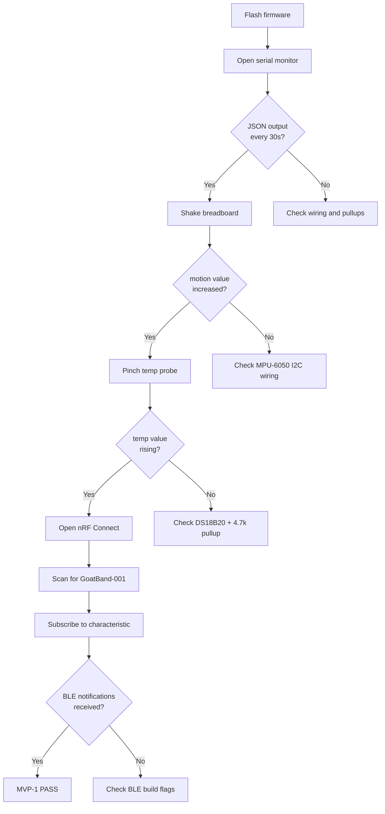

# GoatBand — Build, Test, and Deployment Guide

## 1. Prerequisites

### Software

| Tool | Version | Purpose |
|------|---------|---------|
| VS Code | Latest | IDE |
| PlatformIO IDE | Extension | Build system, toolchain manager |
| ESP-IDF | v5.x (auto-downloaded) | Firmware framework |
| nRF Connect | Mobile app | BLE testing |

### Hardware (MVP-1 Build)

| Item | Purpose |
|------|---------|
| ESP32 NodeMCU-32S | Development board |
| MPU-6050 GY-521 module | Motion sensor |
| DS18B20 waterproof probe | Temperature sensor |
| 4.7kΩ resistor | 1-Wire pullup |
| 100kΩ resistors (x2) | Battery voltage divider |
| 18650 Li-ion cell + holder | Power supply |
| TP4056 module (USB-C) | Battery charging |
| SPDT slide switch | Power switch |
| Breadboard + jumper wires | Prototyping |
| USB cable | Flashing |

## 2. Build and Flash

### Setup

1. Install **VS Code**
2. Install the **PlatformIO IDE** extension
3. Open the `firmware/` folder as a PlatformIO project
4. PlatformIO downloads ESP-IDF v5.x automatically on first build — no manual toolchain install
5. Connect the ESP32 over USB-C

### Build

```bash
pio run
```

### Flash

```bash
pio run --target upload
```

Upload speed: 921600 baud. Auto-detects serial port.

### Monitor

```bash
pio device monitor
```

Or from PlatformIO sidebar: Build → Upload → Monitor.

### Expected Serial Output

```
I (xxx) goatband: GoatBand MVP-1 starting
I (xxx) mpu6050: MPU-6050 initialized
I (xxx) ds18b20: DS18B20 initialized
I (xxx) battery: ADC calibration enabled (line fitting)
I (xxx) ble: advertising started
I (xxx) goatband: {"t":30,"motion":0.018,"temp":27.43,"batt":3.92,"score":0}
```

JSON appears every 30 seconds.

## 3. Testing — No Goat Needed

### Bench Test Flowchart



### Sensor Validation Table

| Test | Action | Expected Result |
|------|--------|----------------|
| Motion at rest | Board on table | `motion` < 0.1 m/s² |
| Motion active | Shake board | `motion` > 1.0 m/s² |
| Temp ambient | Probe in air | `temp` ≈ 25–30°C |
| Temp body | Pinch probe | `temp` rising toward 35°C |
| Battery full | Fresh 18650 | `batt` ≈ 4.1–4.2V |
| Battery low | Depleted cell | `batt` < 3.3V |
| Score rest | Board still | `score` ≈ 0–5 |
| Score active | Shake vigorously | `score` > 50 |
| Multimeter check | Measure battery | `batt` field matches to within 0.05V |

### BLE Testing with nRF Connect

1. Install **nRF Connect** (Nordic Semiconductor) on your phone
2. Scan for BLE devices
3. Find `GoatBand-001` in scan list
4. Tap Connect
5. Navigate to custom service (UUID ending `...DEF0`)
6. Find characteristic (UUID ending `...DEF1`)
7. Tap subscribe/notify button
8. Verify JSON telemetry appears every 30 seconds
9. Shake the breadboard — `motion` and `score` should jump immediately
10. Pinch the DS18B20 probe — `temp` should rise toward body temperature

## 4. Pre-Flash Checklist

Before flashing any band:

- [ ] Battery voltage between 3.4V and 4.2V (multimeter check)
- [ ] All ground rails connected to single point
- [ ] 4.7kΩ pullup on DS18B20 data line — easy to forget
- [ ] ESP32 board variant set to NodeMCU-32S in platformio.ini
- [ ] Upload speed 921600 — slower if errors

## 5. Pre-Deploy Checklist (MVP-2 Onward)

Before deploying on a goat:

- [ ] Enclosure sealed, silica gel inside
- [ ] Strap fits 2 fingers under — not tight, not loose
- [ ] Smooth all edges that contact skin
- [ ] Logged 1 hour on bench without errors
- [ ] Battery > 80% before deployment
- [ ] Vet has approved the test

## 6. Troubleshooting

| Symptom | Likely Cause | Fix |
|---------|-------------|-----|
| No serial output | Wrong baud rate | Set monitor to 115200 |
| `WHO_AM_I check failed` | MPU-6050 not connected | Check I2C SDA/SCL wiring |
| `no presence pulse` | DS18B20 not detected | Check 4.7kΩ pullup, GPIO 4 wiring |
| `ADC calibration unavailable` | No eFuse cal data | Non-critical, uses fallback |
| BLE not advertising | Build flags missing | Verify BT flags in platformio.ini |
| `motion` always 0 | I2C bus error | Check SDA/SCL not swapped |
| `temp` shows -127.0 | DS18B20 read failed | Check 1-Wire wiring |
| `batt` reads 0.0 | ADC read failure | Check divider on GPIO 35 |
| Upload fails | Port not detected | Try different USB cable, check driver |

## 7. Risks and Mitigations

| Risk | How to Detect Early | What to Do |
|------|-------------------|------------|
| Strap chafes goat's neck | Visible irritation by day 2 of MVP-2 | Sew soft cotton liner inside strap |
| Battery dies faster than spec | MVP-1 measures actual mAh draw | Increase sleep duration between samples |
| LoRa range less than 200m | MVP-4 walk test | Add second hub or repeater |
| Baseline learning is noisy | MVP-3 produces too many warnings | Extend learning to 7 days, increase stdev multiplier |
| Farmer ignores app alerts | MVP-5 — alerts don't lead to vet visits | Switch to SMS, or auto-call |
| Goats remove bands | Find unworn band on the ground | Tighter buckle, anti-tamper design |

## 8. What to Build After MVP-5

If MVP-5 succeeds (farmer notices the under-fed goat from your alert before noticing visually), you have product-market fit:

- **Custom PCB** — perfboard works for 5, not for 50. Use KiCad, fab at JLCPCB
- **Battery-swap mechanism** — only when reuse becomes necessary
- **Injection-molded enclosure** — only at 100+ units
- **Cellular fallback** — for farms without sheds, defer until customer asks
- **Health AI** — feed time-series data into ML model after collecting months of data
