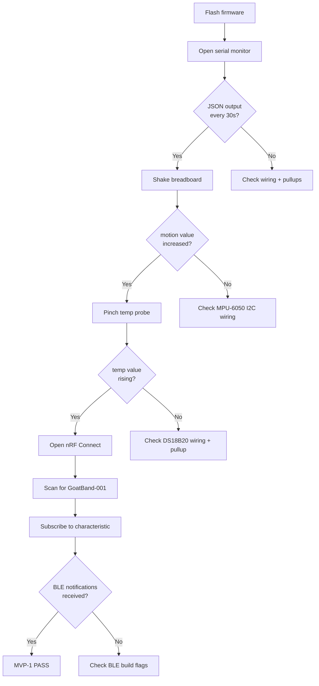

# GoatBand — Build and Deployment Guide

## 1. Prerequisites

### Software Requirements

| Tool | Version | Purpose |
|------|---------|---------|
| VS Code | Latest | IDE |
| PlatformIO IDE | Extension | Build system, toolchain manager |
| ESP-IDF | v5.x (auto-downloaded) | Firmware framework |
| Git | Latest | Version control |
| nRF Connect | Mobile app | BLE testing |

### Hardware Requirements

| Item | Specification |
|------|--------------|
| ESP32 NodeMCU-32S | Development board |
| MPU-6050 module | Breakout with I2C header |
| DS18B20 probe | Waterproof with cable |
| 4.7kΩ resistor | 1-Wire pullup |
| 100kΩ resistors (x2) | Battery voltage divider |
| 18650 Li-ion cell | 3.7V, 2600+ mAh |
| TP4056 charge module | USB-C preferred |
| Breadboard + jumper wires | For MVP-1 prototyping |
| USB cable | USB-C or micro-USB to PC |

## 2. Project Setup

### 2.1 Clone the Repository

```bash
git clone <repository-url>
cd GoatBand_release/firmware
```

### 2.2 Open in PlatformIO

1. Launch VS Code
2. Install the **PlatformIO IDE** extension if not already installed
3. File → Open Folder → select the `firmware/` directory
4. PlatformIO detects `platformio.ini` and configures the project
5. First build triggers automatic download of ESP-IDF v5.x toolchain

### 2.3 PlatformIO Configuration

The `platformio.ini` specifies:

```ini
[env:nodemcu-32s]
platform = espressif32@6.7.0
board = nodemcu-32s
framework = espidf
monitor_speed = 115200
upload_speed = 921600

build_flags =
    -DCONFIG_BT_ENABLED=1
    -DCONFIG_BT_BLUEDROID_ENABLED=1
    -DCONFIG_BT_BLE_ENABLED=1

board_build.partitions = partitions.csv
```

## 3. Build Process

### 3.1 Build

From PlatformIO sidebar or terminal:

```bash
pio run
```

Build outputs:
- Firmware binary: `.pio/build/nodemcu-32s/firmware.bin`
- Partition table: `.pio/build/nodemcu-32s/partitions.bin`
- Bootloader: `.pio/build/nodemcu-32s/bootloader.bin`

### 3.2 Flash

Connect ESP32 via USB, then:

```bash
pio run --target upload
```

Upload speed: 921600 baud. The tool auto-detects the serial port.

### 3.3 Monitor Serial Output

```bash
pio device monitor
```

Expected output (every 30 seconds):

```
I (1234) goatband: GoatBand MVP-1 starting
I (1235) mpu6050: MPU-6050 initialized
I (1236) ds18b20: DS18B20 initialized
I (1237) battery: ADC calibration enabled (line fitting)
I (1238) ble: advertising started
I (31234) goatband: {"t":30,"motion":0.018,"temp":27.43,"batt":3.92,"score":0}
```

## 4. Testing Procedures

### 4.1 Bench Test (No Goat Required)



### 4.2 Sensor Validation

| Test | Action | Expected Result |
|------|--------|----------------|
| Motion at rest | Board on table | `motion` < 0.1 m/s² |
| Motion active | Shake board | `motion` > 1.0 m/s² |
| Temperature ambient | Probe in air | `temp` ≈ 25–30°C |
| Temperature body | Pinch probe | `temp` rising toward 35°C |
| Battery full | Fresh 18650 | `batt` ≈ 4.1–4.2V |
| Battery low | Depleted cell | `batt` < 3.3V |
| Activity score rest | Board on table | `score` ≈ 0–5 |
| Activity score active | Shake vigorously | `score` > 50 |

### 4.3 BLE Testing with nRF Connect

1. Install **nRF Connect** (Nordic Semiconductor) on your phone
2. Scan for BLE devices
3. Find `GoatBand-001` in the scan list
4. Tap Connect
5. Navigate to the custom service (UUID ending `...DEF0`)
6. Find the characteristic (UUID ending `...DEF1`)
7. Tap the subscribe/notify button
8. Verify JSON telemetry appears every 30 seconds

## 5. Wiring Guide

### 5.1 Breadboard Layout

Refer to `diagrams/03_breadboard_tinkercad.png` for the photorealistic layout.

### 5.2 Connection Table

| From | To | Wire |
|------|----|------|
| ESP32 GPIO 21 | MPU-6050 SDA | Blue |
| ESP32 GPIO 22 | MPU-6050 SCL | Yellow |
| ESP32 GPIO 4 | DS18B20 DATA | Green |
| DS18B20 DATA | 3V3 via 4.7kΩ | Pullup |
| ESP32 GPIO 35 | Divider midpoint | Orange |
| Battery + | 100kΩ → midpoint → 100kΩ → GND | Divider |
| ESP32 3V3 | MPU-6050 VCC, DS18B20 VCC | Red |
| ESP32 GND | MPU-6050 GND, DS18B20 GND | Black |

## 6. Troubleshooting

| Symptom | Likely Cause | Fix |
|---------|-------------|-----|
| No serial output | Wrong baud rate | Set monitor to 115200 |
| `WHO_AM_I check failed` | MPU-6050 not connected | Check I2C SDA/SCL wiring |
| `no presence pulse` | DS18B20 not detected | Check 4.7kΩ pullup, GPIO 4 wiring |
| `ADC calibration unavailable` | No eFuse cal data | Non-critical, uses fallback |
| BLE not advertising | Build flags missing | Verify `-DCONFIG_BT_ENABLED=1` in platformio.ini |
| `motion` always 0 | I2C bus error | Check SDA/SCL not swapped |
| `temp` shows -127.0 | DS18B20 read failed | Check 1-Wire wiring |
| `batt` reads 0.0 | ADC read failure | Check divider on GPIO 35 |

## 7. Production Deployment Checklist

- [ ] Replace breadboard with custom PCB
- [ ] Add waterproof enclosure for neckband
- [ ] Calibrate ADC with known battery voltage
- [ ] Replace DS18B20 bit-bang with maintained component library
- [ ] Enable LoRa (MVP-4) and verify range in shed environment
- [ ] Implement deep sleep (MVP-2) and validate power profile
- [ ] Set up OTA update infrastructure (MVP-5)
- [ ] Replace `BLE_DEVICE_NAME` with per-device unique ID
- [ ] Load-test with 5 concurrent bands on one hub
